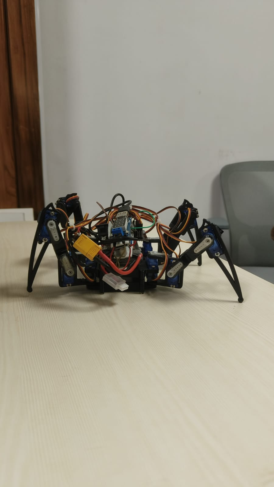
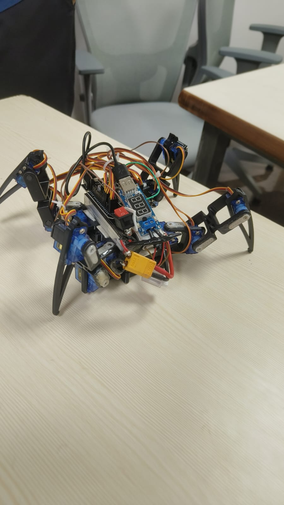

# Quadruped Spider Robot using ESP32

A four-legged spider-inspired robot built using an ESP32 microcontroller and twelve micro servo motors.  
The robot uses inverse kinematics for coordinated walking motion and can be controlled wirelessly through a Bluetooth mobile application.

---

## Robot Prototype

### Front View

### Top View

---

## Project Overview

This project focuses on the development of a quadruped robotic platform capable of stable locomotion.  
The system consists of a 3D-printed mechanical structure with four legs, each having three degrees of freedom: **coxa, femur, and tibia** joints.

The robot is controlled by an **ESP32 microcontroller mounted on an expansion board**, which drives **12 servo motors** to generate coordinated walking patterns.

---

## Hardware Components

- ESP32 Microcontroller  
- ESP32 Expansion Board  
- 12 × Micro Servo Motors  
- 3D Printed Spider-bot Chassis  
- 12V Battery  
- 2 × Buck Converters  
- Servo wiring harness

---

## Power System

The robot uses a **12V battery** as the main power source.  
Two buck converters are used to regulate the voltage:

- One converter powers the **ESP32 controller**
- The second converter powers the **servo motors**

This separation prevents voltage drops and avoids **ESP32 brownout resets during high current draw**.

---

## Control System

The robot is controlled wirelessly through **Bluetooth communication**.

A mobile application built using **MIT App Inventor** sends character commands to the ESP32:

| Command | Action |
|-------|------|
| F | Move Forward |
| B | Move Backward |
| L | Turn Left |
| R | Turn Right |
| W | Wave |

The ESP32 receives these commands and updates the servo angles to produce coordinated walking motion.

---

## Locomotion Method

Each leg contains **three joints**:

1. **Coxa Joint** – horizontal rotation of the leg  
2. **Femur Joint** – vertical lifting movement  
3. **Tibia Joint** – extension of the lower leg

Using **inverse kinematics calculations**, the system determines the correct joint angles required to move the robot smoothly.  
Servo positions are updated approximately every **20 milliseconds** to produce stable gait motion.

---

## Code Structure

The code is located in the **control** folder.

| File | Description |
|-----|-------------|
| `spiderbot_servo_calibration.ino` | Centers all servos at 90° for correct horn alignment |
| `spiderbot_main_control.ino` | Main locomotion and Bluetooth control program |

---

## Applications

Quadruped robots with stable locomotion can be used in several areas:

- Search and rescue operations  
- Inspection of hazardous environments  
- Industrial facility inspection  
- Rough terrain exploration  
- Robotics research and education

Legged robots can traverse environments where wheeled robots struggle.

---

## Project Team

- **Reane Coelho**
- **Daksh M**
- **Pranav P**

**Mentor:** Pulkit Garg

---

## Documentation

Full project documentation is available in the **Document** folder.

---

